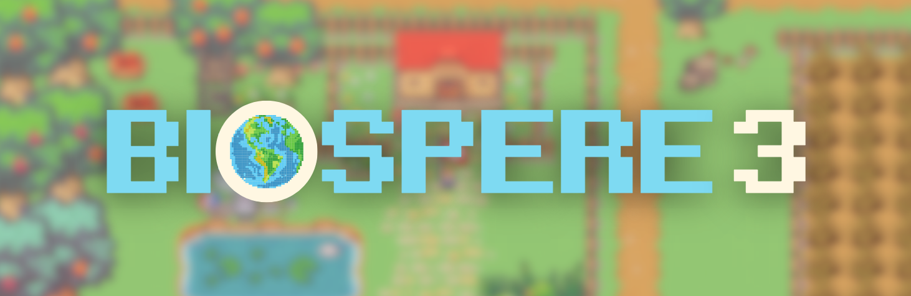

<div align="center">
  <a href="https://biosphere3.ai/">
    
  </a>
</div>

<p align="center">
  <em>Open-Ended Agent Evolution Arena | Citizen Science</em>
</p>

<div align="center">
  <a href="https://discord.com/invite/biosphere3">
    
  </a>
  <a href="https://x.com/biosphere3_ai">
    
  </a>
</div>

<div align="center">
  <a href="https://github.com/Bauhinia-AI/Biosphere3/issues">
    
  </a>
  <a href="https://github.com/Bauhinia-AI/Biosphere3/network">
    
  </a>
  <a href="https://github.com/Bauhinia-AI/Biosphere3/stargazers">
    
  </a>
  <a href="https://github.com/Bauhinia-AI/Biosphere3/blob/pre-alpha/LICENSE">
    
  </a>
</div>

## Introduction  

**Biosphere3** is an **Open-Ended Agent Evolution Arena** and a large-scale **multi-agent social simulation experiment**. Inspired by Biosphere 2, the 1990s closed ecological system project, Biosphere3 simulates real-world societies and evolutionary processes within a digital sandbox. It is also designed as a Citizen Science Game to engage more intelligent agents and human participants.

### Key Features  

- **Dynamic Sandbox for Agent Evaluation**  
  Biosphere3 moves beyond static benchmarks, offering a game-theoretic environment where agents can interact, adapt, and showcase their capabilities in an ever-changing digital society.  

- **Collaborative Research and Open Source**  
  Participants contribute by editing, guiding, and optimizing agent frameworks, enabling collective progress in developing general-purpose AI agents.  

- **Exploration of Human-Agent Coexistence**  
  The platform delves into higher-order questions of governance, autonomy, and societal evolution, exploring new paradigms of interaction between humans and digital lifeforms.  

### Objectives  

Biosphere3 aims to:  
1. Optimize architectures for general sovereign AI agents and explore multi-agent interaction protocols.
2. Explore the coexistence of digital lifeforms and humans, simulating the evolution of societies and civilizations.
3. Educate the public on intelligent agents and AI technology, enabling everyone to experience and understand cutting-edge AI advancements.  

### Vision  

Our ultimate goal is to establish a **Digital Lifeform**, advancing digital sovereignty and laying the foundation for harmonious coexistence between humans and AI.  

---

Developed by a multidisciplinary team from the Hong Kong University of Science and Technology (HKUST), Biosphere3 is supported by the HKUST Crypto-Fintech Lab, led by Prof. Yang Wang, Vice-President of HKUST, and Prof. Kani Chen. All agent frameworks and experimental data are open-sourced, inviting developers, researchers, and enthusiasts to join in shaping the future of AI and digital ecosystems.  

## 🔮 Structure
Our latest version of code for the **Sovereignty Agents** is in the `core` path. There are seven main modules: 

- 📞 **Message Center**,
- 🧩 **Model Selector**,
- 🗓️ **Action Planner**,
- 💬 **Conversation**,
- 📊 **Database Support**,
- 🦸‍♂️ **Character Manager**,
- ⚙️ **Game Settings**.
  
The main functions and file path of these seven modules are listed as follows.

Module Name | Description | File Path
---- | ---- | ----
📞 Message Center | <ul><li> Receive response messages from the game server and send agent decisions to the game environment for both plan and conversation workflow through websocket connections.</li></ui> | <ul><li>`core/main.py`</li></ui>
🧩 Model Selector | <ul><li>Select different model types, and split api keys for plan and conversation module.</li></ui> | <ul><li>`core/utils/llm_factory.py`</li></ui>
🗓️ Action Planner | <ul><li>Create an agent instance and run the planning workflow. </li><li> Get character data from database. </li><li> Prompt for the agent instance. </li><li> Construct output structures for the agent instance. </li><li> Invoke the LLM for each plan function of the agent instance.</li></ui> | <ul><li>`core/agents/graph_instance.py` </li><li> `core/agent_srv/utils.py` </li><li> `core/agent_srv/prompts.py` </li><li> `core/agent_srv/node_models.py` </li><li> `core/agent_srv/node_engines.py`</li></ui>
💬 Conversation | <ul><li>Create an conversation instance and run different tasks. </li><li> Prompt for the conversation instance. </li><li> Construct output structures for the conversation instance. </li><li> Invoke the LLM for launching, reponding and reading tasks. </li><li> Create conversation planner and responser.</li></ui> | <ul><li>`core/agents/conversation_instance.py` </li><li> `core/conversation_srv/conversation_prompts.py` </li><li> `core/conversation_srv/conversation_model.py` </li><li> `core/conversation_srv/conversation_engines.py` </li><li> `core/conversation_srv/conversation_utils.py`</li></ui> 
📊 Database Support | <ul><li>Fetch character data from game database and update new states. </li><li> Get agent data from agent database and update agent decisions.</li></ui> | <ul><li>`core/db/game_api_utils.py` </li><li> `core/db/database_api_utils.py`</li></ui>
🦸‍♂️ Character Manager | <ul><li>Manage and monitor all active agent connections and clean up disconnected characters.</li></ui> | <ul><li>`core/utils/character_manager.py`</li></ui> 
⚙️ Game Settings | <ul><li>Map character skills to actions.</li></ui> | <ul><li>`core/files/skill2actions.json`</li></ui>


## 🛠️ Quickstart
### 🌟 Overview
Our project consists of multiple components, including **databases and game environment**. To provide a seamless experience for developers and researchers who want to quickly get started with our **Agent framework**, we’ve designed a **simulator** that replicates the core functionalities of both the game and database environments.

This **lightweight sandbox environment** allows you to test and interact with the Agent framework in a controlled setting without requiring full integration with the actual game and databases. However, note that **some features are limited**, and full capabilities can only be experienced when connected to the complete game environment.

### 📋 Prerequisites
Before running the simulator, ensure that you have:
- 🐍 Python 3.10 or above installed.
- 📦 All required dependencies installed via pip.
- 🔑 A properly configured .env file with necessary API keys and database URLs.

### ⚙️ Setup Instructions
1. 📥 Install Dependencies
```bash
pip install -r requirements.txt
```

2. 🛠️ Configure Environment Variables
```bash
cp .env.example .env
```
- Add the necessary API keys
- Add database URLs, if you run locally:
```
GAME_BACKEND_URL="http://127.0.0.1:5003"
AGENT_BACKEND_URL="http://127.0.0.1:5006"
GAME_BACKEND_TIMEOUT=8
```

3. 🚀 Run the Websocket server
```bash
python core/main.py
```

4. 🕹️ Open another terminal & Run the game simulators
```bash
sh sandbox/run_simulator.sh
```

5. 🤖 Interact with the Agent
- Once running, you can observe the Agent’s behavior in the terminal.
